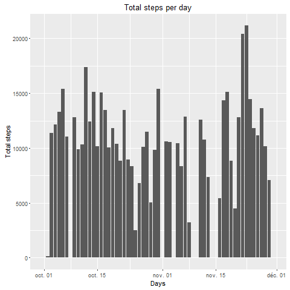
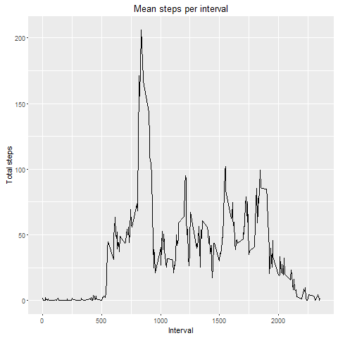
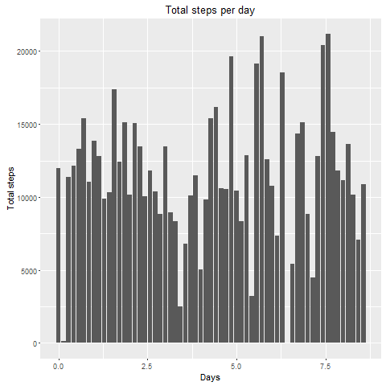
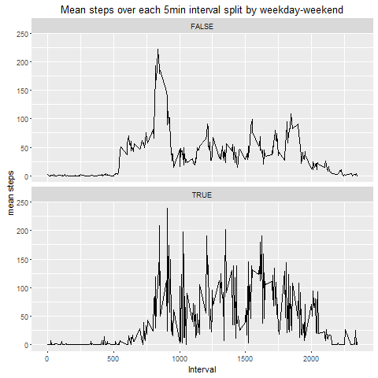

## Loading and preprocessing the data

The data consists of two months of data from an anonymous individual collected during the months of October and November, 2012 and include the number of steps taken in 5 minute intervals each day.

The data is a .zip file.

```{r, echo=FALSE}

library(ggplot2)
library(lubridate)
library(dplyr)
library(lattice)

```

```{r, echo=TRUE}

url <- "https://d396qusza40orc.cloudfront.net/repdata%2Fdata%2Factivity.zip"
download.file(url, "datafile.zip")

unzip("datafile.zip")
dt <- read.csv(file="activity.csv", header = TRUE, stringsAsFactors = FALSE)

```

The "date" variable is to be converted.

```{r, echo=TRUE}

dt$date <- as.Date(dt$date)

```

## What is mean total number of steps taken per day?

First, the data are grouped by date and then summarized according to the sum of steps per day.

```{r, echo=TRUE}

by_day <- group_by(dt, date)
stepsperday <- summarize(by_day, total_steps_per_day=sum(steps, na.rm = TRUE))

```

## Make a histogram of the total number of steps taken each day

Using ggplot to create an histogram for the total number of steps per day.

```{r, echo=TRUE, eval=FALSE}

ggplot(stepsperday, aes(x=date, y=total_steps_per_day))+
    geom_bar(stat="identity")+
    xlab("Days")+
    ylab("Total steps")+
    ggtitle("Total steps per day")

```



## Calculate and report the mean and median of the total number of steps taken per day

The calculation uses the summarize function.

```{r, echo=TRUE}

print(summarize(stepsperday, 
          mean_steps=round(mean(stepsperday$total_steps_per_day),0), 
          median_steps=median(stepsperday$total_steps_per_day)))

```

## What is the average daily activity pattern?

The data frame is grouped by interval. Then the function summarize returns the mean steps per interval.
Ploting was done using ggplot.

```{r, echo=TRUE}

by_interval <- group_by(dt, interval)
stepsperinterval_mean <- summarize(by_interval, mean_steps_per_interval=mean(steps, na.rm=TRUE))

```

```{r, echo=TRUE, eval=FALSE}

ggplot(stepsperinterval_mean, aes(x=interval, y=mean_steps_per_interval))+
    geom_line()+
    xlab("Interval")+
    ylab("Total steps")+
    ggtitle("Mean steps per interval")

```



The 5-minutes interval which contains the maximum number of steps is `r stepsperinterval_mean[which(stepsperinterval_mean$mean_steps_per_interval==max(stepsperinterval_mean$mean_steps_per_interval)), "interval"]`

## Imputing missing values

Replacing NA by using multivariate imputations.

```{r, echo=TRUE}

#Calculate and report the total number of missing values in the dataset
library(mice)
md.pattern(dt)

```

There are 2304 missing values in the steps variables.


```{r, echo=FALSE}

#Transformation of the "date"" variable into a numeric variable (number of weeks calculated from the starting date for each observation)
dt$date<-as.numeric(difftime(time1 = dt$date, time2 = dt$date[1], units = "weeks"))

#imputation of missing values using "predictive mean matching".
temp <- mice(dt,m=5,maxit=5,meth='pmm',seed=500)

#creation of a new dataset that is equal to the original dataset but with the missing data filled in.
dt_withoutNA <- complete(temp, 1)

#making a histogram of the total number of steps taken each day with the new dataset

by_day2 <- group_by(dt_withoutNA, date)
stepsperday_withoutNA <- summarize(by_day2, total_steps_per_day2=sum(steps, na.rm = TRUE))
```

```{r, echo=FALSE, eval=FALSE}

ggplot(stepsperday_withoutNA, aes(x=date, y=total_steps_per_day2))+
    geom_bar(stat="identity")+
    xlab("Days")+
    ylab("Total steps")+
    ggtitle("Total steps per day")

```


```{r, echo=TRUE}
#reporting the mean and median total number of steps taken per day

print(summarize(stepsperday_withoutNA, 
          mean_steps_withoutNA=round(mean(stepsperday_withoutNA$total_steps_per_day2),0), 
          median_steps_withoutNA=median(stepsperday_withoutNA$total_steps_per_day2)))

```

The values of the mean and median differ.
Imputing missing data increased the estimates of the total daily number of steps.

## Are there differences in activity patterns between weekdays and weekends?

```{r, echo=TRUE}

#reload the data
dt <- read.csv(file="activity.csv", header = TRUE, stringsAsFactors = FALSE)
#"date" transformation
dt$date <- as.Date(dt$date)

```

```{r, echo=TRUE}

#Create a new factor variable in the dataset returning FALSE if the date correspond to a weekday.

dt_withweekdaysfactor <- mutate(dt, weekfactor=(weekdays(dt$date)==c("samedi", "dimanche")))

by_interval2 <- group_by(dt_withweekdaysfactor, interval, weekfactor)

stepsperinterval_mean_withweekfactor <- summarize(by_interval2, mean_steps_per_interval2=mean(steps, na.rm=TRUE))
```

```{r, echo=TRUE, eval=FALSE}

ggplot(stepsperinterval_mean_withweekfactor, aes(x=interval, y=mean_steps_per_interval2))+
    geom_line()+
    facet_wrap(~weekfactor, nrow=2, ncol=1)+
    xlab("Interval")+
    ylab("mean steps")+
    ggtitle("Mean steps over each 5min interval split by weekday-weekend")

```


